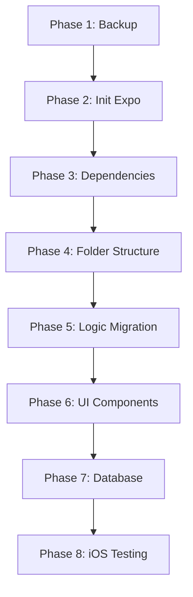

# FitApp: React Web → React Native Migration Plan

> **Prepared by:** Senior Full-Stack Developer & Mobile Specialist  
> **Date:** January 17, 2026

---

## Executive Summary

This document outlines a comprehensive, step-by-step migration strategy to transition FitApp from a React (Web) application to a React Native mobile application using Expo with TypeScript. The migration preserves the existing Git repository history and retains all web files in an `/old` folder for reference.

---

## Current Project Analysis

### Tech Stack
| Layer | Current (Web) | Target (Mobile) |
|-------|---------------|-----------------|
| Framework | React 19.2.3 | React Native (Expo SDK 52) |
| Language | TypeScript 5.8.2 | TypeScript 5.x |
| Build Tool | Vite 6.2.0 | Metro Bundler (Expo) |
| Backend | Supabase (`@supabase/supabase-js` 2.90.1) | Supabase (same package) |
| Styling | Tailwind CSS (inline classes) | StyleSheet + NativeWind (optional) |

### Files to Migrate

| Category | Files | Can Reuse? |
|----------|-------|------------|
| **Auth Logic** | `auth/AuthContext.tsx`, `auth/authService.ts`, `auth/types.ts` | ✅ 90% (hooks, services unchanged) |
| **Type Definitions** | `types.ts`, `auth/types.ts` | ✅ 100% |
| **Design Tokens** | `theme.ts` | ✅ 80% (adapt for RN StyleSheet) |
| **Supabase Client** | `supabase.ts` | ⚠️ Needs env var update (EXPO_PUBLIC_*) |
| **Screens** | `WorkoutScreen`, `LibraryScreen`, `HistoryScreen`, `ProfileScreen`, `LoginScreen` | 🔄 Rewrite UI, keep logic |
| **UI Components** | `Button.tsx`, `Input.tsx`, `Text.tsx`, `GlassCard.tsx` | 🔄 Rewrite for RN primitives |
| **App Shell** | `App.tsx` | 🔄 Replace with RN navigation |

---

## Phase 1: Project Cleanup & Backup

### 1.1 Create Backup Directory

```bash
# Create /old directory and move all current files
mkdir old
```

### 1.2 Move Web Files to /old

```bash
# Move all web-related files and directories
mv App.tsx auth components constants.ts index.html index.tsx \
   metadata.json package.json package-lock.json node_modules \
   supabase.ts theme.ts tsconfig.json types.ts vite.config.ts dist .env .env.local old/
```

### 1.3 Update .gitignore

Keep root `.gitignore` but add entries for the new Expo project:

```gitignore
# Existing entries remain
# Add Expo-specific ignores:
node_modules/
.expo/
dist/
web-build/
*.jks
*.p8
*.p12
*.key
*.mobileprovision
*.orig.*
.env.local
.env*.local
```

### 1.4 Git Commit Backup

```bash
git add -A
git commit -m "chore: backup web files to /old before React Native migration"
```

---

## Phase 2: Environment Initialization

### 2.1 Initialize Expo Project

```bash
# Create new Expo project with TypeScript template in current directory
npx create-expo-app@latest . --template blank-typescript --yes
```

> ⚠️ **Note:** The `--yes` flag auto-confirms prompts. If the command fails due to existing files, ensure only `/old`, `.git`, `.gitignore`, `README.md`, and `ai-tasks` remain in root.

### 2.2 Install Core Dependencies

```bash
# Navigation
npx expo install @react-navigation/native @react-navigation/bottom-tabs
npx expo install react-native-screens react-native-safe-area-context

# Supabase
npm install @supabase/supabase-js

# AsyncStorage for auth persistence
npx expo install @react-native-async-storage/async-storage

# Icons (Material Symbols equivalent)
npx expo install @expo/vector-icons

# Linear Gradient (for glass effects)
npx expo install expo-linear-gradient expo-blur

# NativeWind (Tailwind CSS for React Native - styling parity with web)
npm install nativewind tailwindcss
npx tailwindcss init

# Keyboard handling (for workout forms and inputs)
npx expo install react-native-keyboard-controller

# SVG support (for vector icons and graphics)
npx expo install react-native-svg
npm install --save-dev react-native-svg-transformer
```

### 2.3 Configure NativeWind

Update `tailwind.config.js`:

```javascript
/** @type {import('tailwindcss').Config} */
module.exports = {
  content: [
    "./App.{js,jsx,ts,tsx}",
    "./src/**/*.{js,jsx,ts,tsx}"
  ],
  presets: [require("nativewind/preset")],
  theme: {
    extend: {},
  },
  plugins: [],
};
```

Update `babel.config.js`:

```javascript
module.exports = function (api) {
  api.cache(true);
  return {
    presets: [
      ["babel-preset-expo", { jsxImportSource: "nativewind" }],
      "nativewind/babel",
    ],
  };
};
```

Create `global.css` in root:

```css
@tailwind base;
@tailwind components;
@tailwind utilities;
```

### 2.4 Environment Variables Setup

Create `app.config.ts` for dynamic configuration:

```typescript
import 'dotenv/config';

export default {
  expo: {
    name: "FitApp",
    slug: "fitapp",
    version: "1.0.0",
    orientation: "portrait",
    icon: "./assets/icon.png",
    userInterfaceStyle: "automatic",
    splash: { /* ... */ },
    ios: {
      supportsTablet: true,
      bundleIdentifier: "com.vdemish.fitapp"
    },
    android: {
      adaptiveIcon: { /* ... */ },
      package: "com.vdemish.fitapp"
    },
    extra: {
      supabaseUrl: process.env.EXPO_PUBLIC_SUPABASE_URL,
      supabaseAnonKey: process.env.EXPO_PUBLIC_SUPABASE_ANON_KEY,
    },
  },
};
```

Create `.env` file:

```env
EXPO_PUBLIC_SUPABASE_URL=<copy from old/.env>
EXPO_PUBLIC_SUPABASE_ANON_KEY=<copy from old/.env>
```

---

## Phase 3: Dependency Audit

### 3.1 Dependencies Analysis

| Web Dependency | Action | RN Replacement |
|----------------|--------|----------------|
| `react` | ✅ Keep | Same (Expo bundles it) |
| `react-dom` | ❌ Remove | Not needed in RN |
| `@supabase/supabase-js` | ✅ Keep | Same package |
| `vite` | ❌ Remove | Metro Bundler (auto) |
| `@vitejs/plugin-react` | ❌ Remove | Not needed |

### 3.2 New Required Dependencies

```json
{
  "dependencies": {
    "@supabase/supabase-js": "^2.90.1",
    "@react-navigation/native": "^7.x",
    "@react-navigation/bottom-tabs": "^7.x",
    "react-native-screens": "latest",
    "react-native-safe-area-context": "latest",
    "@react-native-async-storage/async-storage": "latest",
    "expo-linear-gradient": "latest",
    "expo-blur": "latest",
    "nativewind": "^4.x",
    "react-native-keyboard-controller": "latest",
    "react-native-svg": "latest"
  },
  "devDependencies": {
    "tailwindcss": "^3.x",
    "react-native-svg-transformer": "latest"
  }
}
```

---

## Phase 4: Architecture Setup

### 4.1 Recommended Folder Structure

```
/FitApp
├── app/                    # If using Expo Router (optional)
├── src/
│   ├── components/
│   │   ├── ui/             # Reusable primitives
│   │   │   ├── Button.tsx
│   │   │   ├── Input.tsx
│   │   │   ├── Text.tsx
│   │   │   └── GlassCard.tsx
│   │   └── ...             # Feature components
│   ├── screens/
│   │   ├── WorkoutScreen.tsx
│   │   ├── LibraryScreen.tsx
│   │   ├── HistoryScreen.tsx
│   │   ├── ProfileScreen.tsx
│   │   └── LoginScreen.tsx
│   ├── navigation/
│   │   ├── RootNavigator.tsx
│   │   └── TabNavigator.tsx
│   ├── hooks/
│   │   └── useAuth.ts
│   ├── services/
│   │   ├── supabase.ts
│   │   └── authService.ts
│   ├── context/
│   │   └── AuthContext.tsx
│   ├── types/
│   │   └── index.ts
│   └── theme/
│       ├── colors.ts
│       ├── typography.ts
│       ├── spacing.ts
│       └── index.ts
├── assets/
│   ├── fonts/
│   └── images/
├── old/                    # Archived web code
├── app.config.ts
├── App.tsx                 # Entry point
├── babel.config.js
├── tsconfig.json
├── tailwind.config.js
├── global.css
└── package.json
```

### 4.2 Configure TypeScript Path Aliases

Update `tsconfig.json` to enable `@/` imports:

```json
{
  "extends": "expo/tsconfig.base",
  "compilerOptions": {
    "strict": true,
    "baseUrl": ".",
    "paths": {
      "@/*": ["src/*"]
    }
  },
  "include": ["**/*.ts", "**/*.tsx"]
}
```

Update `babel.config.js` to resolve path aliases:

```javascript
module.exports = function (api) {
  api.cache(true);
  return {
    presets: [
      ["babel-preset-expo", { jsxImportSource: "nativewind" }],
      "nativewind/babel",
    ],
    plugins: [
      [
        "module-resolver",
        {
          root: ["./"],
          alias: {
            "@": "./src",
          },
        },
      ],
    ],
  };
};
```

Install the required Babel plugin:

```bash
npm install --save-dev babel-plugin-module-resolver
```

**Usage Example:**

```typescript
// Instead of:
import { Button } from '../../../components/ui/Button';

// Use:
import { Button } from '@/components/ui/Button';
```

---

## Phase 5: Logic Migration Strategy

### 5.1 Types (100% Reusable)

```bash
# Copy types directly
cp old/types.ts src/types/index.ts
cp old/auth/types.ts src/types/auth.ts
```

### 5.2 Supabase Client (Minor Changes)

**old/supabase.ts** → **src/services/supabase.ts**

```typescript
// BEFORE (Vite)
const supabaseUrl = import.meta.env.VITE_SUPABASE_URL;

// AFTER (Expo)
import Constants from 'expo-constants';
const supabaseUrl = Constants.expoConfig?.extra?.supabaseUrl;
// OR use process.env.EXPO_PUBLIC_SUPABASE_URL directly
```

### 5.3 Auth Service (90% Reusable)

Copy `old/auth/authService.ts` → `src/services/authService.ts`

**Changes Required:**
1. Update Supabase import path
2. No DOM-related code exists (clean migration)

### 5.4 Auth Context (85% Reusable)

Copy `old/auth/AuthContext.tsx` → `src/context/AuthContext.tsx`

**Changes Required:**
1. Replace `localStorage` with `@react-native-async-storage/async-storage`
2. Update import paths

### 5.5 Theme Tokens (80% Reusable)

**old/theme.ts** → **src/theme/**

Split into modular files and convert CSS units to RN-compatible values:

```typescript
// colors.ts - Keep as-is
export const colors = { /* same values */ };

// typography.ts - Convert rem to numbers
export const typography = {
  fontSize: {
    display: 48,  // was '3rem'
    h1: 30,       // was '1.875rem'
    // ...
  },
  fontFamily: {
    sans: 'SpaceGrotesk-Regular',  // Must load custom font
  },
};

// spacing.ts - Convert rem to numbers
export const spacing = {
  xs: 4,   // was '0.25rem'
  sm: 8,   // was '0.5rem'
  md: 16,  // was '1rem'
  // ...
};
```

---

## Phase 6: UI & Navigation Foundation

### 6.1 Root Application Setup

Wrap the application in required providers for safe area handling and keyboard management:

**App.tsx**

```typescript
import './global.css'; // NativeWind styles
import { SafeAreaProvider } from 'react-native-safe-area-context';
import { KeyboardProvider } from 'react-native-keyboard-controller';
import { NavigationContainer } from '@react-navigation/native';
import { AuthProvider } from '@/context/AuthContext';
import { RootNavigator } from '@/navigation/RootNavigator';

export default function App() {
  return (
    <SafeAreaProvider>
      <KeyboardProvider>
        <NavigationContainer>
          <AuthProvider>
            <RootNavigator />
          </AuthProvider>
        </NavigationContainer>
      </KeyboardProvider>
    </SafeAreaProvider>
  );
}
```

> **Note:** `SafeAreaProvider` manages iOS notch and home indicator insets. `KeyboardProvider` enables advanced keyboard avoidance for workout input forms.

### 6.2 Component Mapping

| Web Element | React Native Equivalent |
|-------------|------------------------|
| `<div>` | `<View>` |
| `<span>`, `<p>` | `<Text>` |
| `<button>` | `<TouchableOpacity>` or `<Pressable>` |
| `<input>` | `<TextInput>` |
| `` | `<Image>` |
| `className=""` | `className=""` (with NativeWind) |
| CSS Tailwind | NativeWind `className` or `StyleSheet.create({})` |

### 6.3 Styling with NativeWind

With NativeWind configured, you can use familiar Tailwind classes directly:

```typescript
import { View, Text, Pressable } from 'react-native';

export function Button({ title, onPress }) {
  return (
    <Pressable 
      className="bg-primary px-6 py-3 rounded-2xl active:opacity-80"
      onPress={onPress}
    >
      <Text className="text-white font-bold text-center">{title}</Text>
    </Pressable>
  );
}
```

> **Benefit:** Maintains styling parity with the web version, reducing the learning curve and enabling faster migration.

### 6.4 Navigation Setup

**src/navigation/TabNavigator.tsx**

```typescript
import { createBottomTabNavigator } from '@react-navigation/bottom-tabs';
import { Ionicons } from '@expo/vector-icons';
import { WorkoutScreen } from '@/screens/WorkoutScreen';
import { LibraryScreen } from '@/screens/LibraryScreen';
import { HistoryScreen } from '@/screens/HistoryScreen';
import { ProfileScreen } from '@/screens/ProfileScreen';

const Tab = createBottomTabNavigator();

export function TabNavigator() {
  return (
    <Tab.Navigator
      screenOptions={({ route }) => ({
        tabBarIcon: ({ focused, color, size }) => {
          let iconName;
          if (route.name === 'Workout') iconName = 'barbell';
          else if (route.name === 'Library') iconName = 'book';
          else if (route.name === 'History') iconName = 'stats-chart';
          else if (route.name === 'Profile') iconName = 'person';
          return <Ionicons name={iconName} size={size} color={color} />;
        },
        tabBarActiveTintColor: '#00c3ff',
        tabBarInactiveTintColor: 'gray',
        tabBarStyle: {
          backgroundColor: 'rgba(16, 20, 35, 0.9)',
          borderTopColor: 'rgba(255, 255, 255, 0.05)',
        },
      })}
    >
      <Tab.Screen name="Workout" component={WorkoutScreen} />
      <Tab.Screen name="Library" component={LibraryScreen} />
      <Tab.Screen name="History" component={HistoryScreen} />
      <Tab.Screen name="Profile" component={ProfileScreen} />
    </Tab.Navigator>
  );
}
```

### 6.5 Glass Effect in RN

Replace CSS `backdrop-blur` with Expo Blur:

```typescript
import { BlurView } from 'expo-blur';

const GlassCard = ({ children }) => (
  <BlurView intensity={20} tint="dark" style={styles.card}>
    {children}
  </BlurView>
);
```

---

## Phase 7: Database Connection

### 7.1 Supabase Configuration for RN

**src/services/supabase.ts**

```typescript
import AsyncStorage from '@react-native-async-storage/async-storage';
import { createClient } from '@supabase/supabase-js';

const supabaseUrl = process.env.EXPO_PUBLIC_SUPABASE_URL!;
const supabaseAnonKey = process.env.EXPO_PUBLIC_SUPABASE_ANON_KEY!;

export const supabase = createClient(supabaseUrl, supabaseAnonKey, {
  auth: {
    storage: AsyncStorage,
    autoRefreshToken: true,
    persistSession: true,
    detectSessionInUrl: false, // Important for RN
  },
});
```

### 7.2 Auth Persistence

The `AsyncStorage` adapter automatically persists the Supabase session across app restarts.

---

## Phase 8: iOS Testing & Debugging

### 8.1 Run on iOS Simulator

```bash
# Start Expo development server
npx expo start

# Press 'i' to open iOS Simulator
# OR run directly:
npx expo run:ios
```

### 8.2 Run on Physical Device

1. Install **Expo Go** app from App Store
2. Scan QR code from terminal with iPhone camera
3. App opens in Expo Go

> ⚠️ **First-Time Setup (iOS 16+):** If this is your first time using the device for development, you must enable **Developer Mode**:
> 1. Go to **Settings → Privacy & Security → Developer Mode**
> 2. Toggle **Developer Mode** ON
> 3. Restart iPhone when prompted
> 4. After restart, confirm enabling Developer Mode

### 8.3 Debugging Tools

```bash
# Open React DevTools
npx expo start --dev-client

# Enable debugging in Expo Go
# Shake device → "Open JS Debugger"
```

### 8.4 Common Issues Checklist

| Issue | Solution |
|-------|----------|
| Metro bundler cache | `npx expo start -c` |
| iOS Simulator not found | `xcrun simctl list devices` |
| Font not loading | Use `expo-font` + `useFonts` hook |
| Env vars undefined | Restart Metro after `.env` changes |

---

## Migration Order Summary



---

## Files Created After Migration

| Step | Command/Action |
|------|----------------|
| 1 | `mkdir old && mv <files> old/` |
| 2 | `npx create-expo-app@latest . --template blank-typescript --yes` |
| 3 | Install navigation, Supabase, AsyncStorage |
| 4 | Create `src/` folder structure |
| 5 | Copy & adapt `types.ts`, `authService.ts`, `AuthContext.tsx` |
| 6 | Rewrite screens with `<View>`, `<Text>`, navigation |
| 7 | Configure Supabase with AsyncStorage |
| 8 | `npx expo start` → press `i` |

---

## Next Steps After Plan Approval

1. **Execute Phase 1-2**: Backup files and initialize Expo project
2. **Execute Phase 3-4**: Install dependencies and create folder structure
3. **Execute Phase 5**: Migrate types, services, and context
4. **Execute Phase 6**: Create navigation and basic screens
5. **Execute Phase 7**: Test Supabase connection
6. **Execute Phase 8**: Run "Hello World" on iOS Simulator

---

> **Constraint Reminder:** This document is the PLAN ONLY. No code execution or file modifications have been performed.
